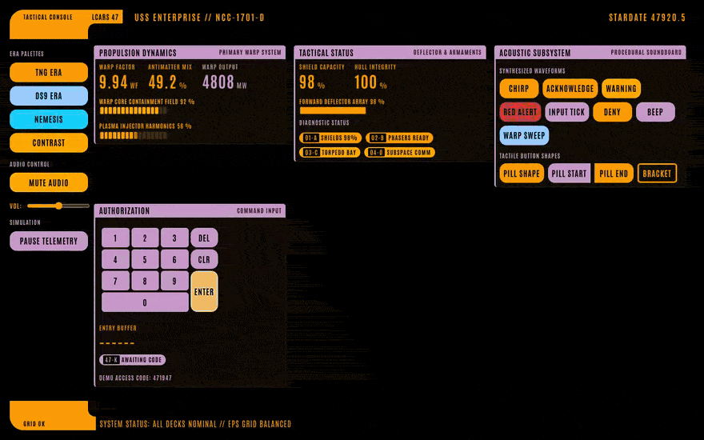

<!--
Copyright 2026 Ronny Trommer <ronny@no42.org>
SPDX-License-Identifier: LGPL-3.0-or-later
-->

# @no42-org/lcars-47

[](https://github.com/no42-org/lcars-47/actions/workflows/ci.yml)
[](https://github.com/no42-org/lcars-47/releases/latest)
[](LICENSE)
[](https://scorecard.dev/viewer/?uri=github.com/no42-org/lcars-47)

Authentic Star Trek LCARS (Library Computer Access / Retrieval System) user interface component library built with Lit Web Components, pure CSS design tokens, and a zero-asset Web Audio API procedural synthesizer.



The workbench above is `index.html` in this repository, recorded live.
Run it yourself with `make dev`.

## Features

- **Web Components**: Built on pure Lit Web Components (`Custom Elements v1` + `Shadow DOM`).
- **Zero-Asset Procedural Audio**: Mathematical waveform synthesis for classic interface sound effects with zero `.mp3` or `.wav` dependencies.
- **Era Color Palettes**: Switch instantly between `TNG` (The Next Generation), `DS9` (Deep Space Nine), `Nemesis` (Late 24th Century), and `High-Contrast` accessibility themes.
- **Geometric Primitives**: Authentic curved elbows (`<lcars-elbow>`), responsive 2D grid layouts (`<lcars-frame>`), tactile pill buttons (`<lcars-button>`), and framed panels (`<lcars-panel>`).
- **Telemetry & Data Displays**: High-precision tabular readouts (`<lcars-readout>`), segmented/continuous level gauges (`<lcars-bargraph>`), and status pills (`<lcars-status-pill>`). Lit batches property changes into a single render per microtask.
- **Tactile Command Input**: An LCARS keypad grid (`<lcars-keypad>`) emitting typed `lcars-change` and `lcars-submit` events, fully operable from a physical keyboard.
- **Self-Contained Typography**: Bundled local `@font-face` definitions for Antonio condensed sans-serif with zero remote CDN calls.
- **Dual Bundle Distribution**: ESM module bundle for modern bundlers (Vite, Rollup, Webpack) and self-contained IIFE bundle for drop-in CDN `<script>` tag usage.

---

## Installation

### Package Manager (ESM)

The package is published to **GitHub Packages**. Point the scope at that registry once, in an `.npmrc` next to your `package.json`:

```
@no42-org:registry=https://npm.pkg.github.com
```

GitHub Packages requires authentication **even for public packages**, so you also need a personal access token with the `read:packages` scope:

```
//npm.pkg.github.com/:_authToken=${GITHUB_TOKEN}
```

Then install as usual:

```bash
npm install @no42-org/lcars-47
```

Import the library and styles in your application:

```typescript
import '@no42-org/lcars-47';
import '@no42-org/lcars-47/css';
import { setLcarsTheme, playLcarsSound } from '@no42-org/lcars-47';
```

### Standalone bundle (no build tooling, no account)

If you would rather not authenticate, the release assets are served anonymously. Grab the two files straight from a release:

```html
<link rel="stylesheet" href="https://github.com/no42-org/lcars-47/releases/download/v0.0.2/lcars.css" />
<script src="https://github.com/no42-org/lcars-47/releases/download/v0.0.2/lcars.iife.js"></script>
```

All custom elements are registered automatically, and the utility functions are available under `window.Lcars`.

For production, download the files and serve them yourself rather than hot-linking, and verify them first — every release ships signed checksums, see [RELEASING.md](RELEASING.md).

---

## Quick Start

```html
<!doctype html>
<html lang="en" data-lcars-theme="tng">
  <head>
    <meta charset="UTF-8" />
    <title>LCARS Console</title>
    <link rel="stylesheet" href="https://github.com/no42-org/lcars-47/releases/download/v0.0.2/lcars.css" />
    <!-- The IIFE bundle is self-contained. The ESM entry externalizes lit, so
         it needs a bundler (or an import map) rather than a plain script tag. -->
    <script src="https://github.com/no42-org/lcars-47/releases/download/v0.0.2/lcars.iife.js"></script>
  </head>
  <body>
    <lcars-frame theme="tng">
      <lcars-elbow slot="elbow-tl" orientation="top-left" heading="LCARS 47" label="SEC-01"></lcars-elbow>
      <div slot="top-bar">USS ENTERPRISE // NCC-1701-D</div>

      <div slot="sidebar">
        <lcars-button sound="acknowledge" color="primary">ENGAGE</lcars-button>
        <lcars-button sound="warning" color="warning">SHIELDS</lcars-button>
        <lcars-button sound="alert" color="alert">RED ALERT</lcars-button>
      </div>

      <div slot="main">
        <lcars-panel heading="PROPULSION" subtitle="WARP DRIVE">
          <lcars-readout label="WARP FACTOR" value="9.94" unit="WF" precision="2"></lcars-readout>
          <lcars-bargraph label="WARP CORE" value="82" max="100" segments="16" show-value unit="%"></lcars-bargraph>
          <lcars-status-pill status="nominal" code="01-A" label="CONTAINMENT STABLE"></lcars-status-pill>
        </lcars-panel>
      </div>

      <div slot="footer-readout">SYSTEM STATUS: NOMINAL</div>
      <lcars-elbow slot="elbow-bl" orientation="bottom-left" label="SYS OK"></lcars-elbow>
    </lcars-frame>
  </body>
</html>
```

---

## Era Themes

Set the active theme globally using `setLcarsTheme()` or the `data-lcars-theme` attribute on the root `<html>` element:

```typescript
import { setLcarsTheme } from '@no42-org/lcars-47';

// Switch active theme
setLcarsTheme('ds9'); // 'tng' | 'ds9' | 'nemesis' | 'contrast'
```

| Theme | Era Description | Primary Accent Colors |
| :--- | :--- | :--- |
| `tng` | 2360s Galaxy-class interface | Butterscotch Gold (`#ff9900`), Lilac (`#cc99cc`), Pale Peach (`#ffaa66`) |
| `ds9` | 2370s Deep Space 9 / Defiant | Ice Blue (`#99ccff`), Magenta (`#cc6699`), Sand Gold (`#eeaa55`) |
| `nemesis` | Late 24th-century Sovereign-class | Teal Cyan (`#00ccff`), Pale Blue (`#88aacc`), Warm Gold (`#ddaa44`) |
| `contrast` | High-contrast tactical mode | Vivid Amber (`#ffaa00`), Pure Cyan (`#33d6ff`), Green (`#00cc66`) |

---

## Component Reference

### `<lcars-frame>`
Responsive 2D CSS grid layout wrapping standard LCARS interfaces.
- **Slots**: `top-bar`, `elbow-tl`, `sidebar`, `main`, `footer-readout`, `footer`, `elbow-bl`, plus the default slot (rendered in the main area).
- `elbow-tl` shares the header row with `top-bar`, and `elbow-bl` shares the footer row with `footer-readout`: the elbow is placed first and sized by its own arch plus heading, and the bar text follows it on the same line.
- **Properties**: `theme` (`'tng' | 'ds9' | 'nemesis' | 'contrast'`), `mainLabel` / `main-label`, `sidebarLabel` / `sidebar-label`.

#### Keyboard and screen readers

`main` and `sidebar` scroll, so both are focusable (`tabindex="0"`): content that has scrolled out of view has to be reachable without a pointer. Chrome 127 and later makes scroll containers keyboard-focusable on its own, but only those that do not already contain focusable descendants — a console region almost always holds a button, so that exemption rarely applies here, and Safari and Firefox do not implement it at all. The focus ring is drawn on keyboard focus only, never on a click.

Both regions are landmarks (`main` and `complementary`) and are announced by role, so neither carries a name by default — the library ships no user-visible strings. Name them when the role alone is not descriptive:

```html
<lcars-frame main-label="ENGINEERING TELEMETRY" sidebar-label="CONSOLE CONTROLS"> … </lcars-frame>
```

Use **one frame per page**. Each renders a `main` landmark, and a document with two of them fails an accessibility audit whatever they are called. A second console on the same page needs its main region demoted to a plain region first.

#### Height and scrolling

The frame is a **viewport shell**: it is exactly `--lcars-frame-height` tall (`100dvh` by default), its header, sidebar and footer stay put, and content that does not fit scrolls *inside* the frame rather than pushing it out of shape.

| region | behaviour |
| :--- | :--- |
| `main`, `sidebar` | scroll their own content |
| header and footer bars | fixed chrome, never scroll |
| the page itself | does not scroll — the frame already fills the viewport |

That last row assumes the host page zeroes its body margin. A default document adds 8px around a `100dvh` frame, which is enough to make the page scroll on top of the frame's own scrolling regions.

To put a frame inside a container instead of the viewport, set the property to a length:

```html
<div style="width: 800px">
  <lcars-frame style="--lcars-frame-height: 400px"> … </lcars-frame>
</div>
```

To fill a container of unknown height, tell the element to fill its parent as well. A percentage needs something definite to resolve against, and the frame deliberately declares no height of its own:

```html
<div style="width: 800px; height: 400px">
  <lcars-frame style="height: 100%; --lcars-frame-height: 100%"> … </lcars-frame>
</div>
```

The frame is as tall as `--lcars-frame-height`, or as tall as its parent when the parent is smaller (see below). It never paints a band of dead space under itself or pushes a following sibling down.

An embedded frame keeps its box whatever the window is doing, because the layout answers to the frame's own width rather than the viewport's — a 640px console stays a pinned shell on a phone, and a 360px one stacks on a desktop.

**A component never paints outside the box you give it.** Where a parent bounds the frame and its content wants more room, it clamps to that parent and scrolls rather than overflowing onto whatever you put next to it. This is inert wherever the parent's height is indefinite, which is every ordinary page.

`<lcars-panel>` follows the same rule, but only when you size the panel itself. A panel placed in a frame region grows to its content and the region scrolls it, which is why panels inside `main` behave as they always have.

Two keyboard limits come with this. A clamped frame scrolls on its own outer box, and that box cannot carry a focus stop the way `main` and `sidebar` do. Focusable content stays reachable, because focus scrolls the frame to follow it. Inert content inside `main`, below the first screen of a frame that is both clamped and stacked, is not. A panel you give an explicit height scrolls its body, and that scroller has no focus stop either, so the same caveat applies to inert content inside it.

**A frame narrower than 600px reverses this.** It becomes an ordinary block that flows with the document: the regions stack (header, sidebar, main, footer), grow to their natural height, and *the page* scrolls, because a console that narrow has no room left for a pinned shell. The threshold is the frame's own width, not the window's. A host page that sets `overflow: hidden` on `body` must relax it, or the footer is clipped away.

### `<lcars-elbow>`
Curved LCARS corner bracket rendered with CSS radii and a concave inner fillet.
- **Properties**: `orientation` (`'top-left' | 'bottom-left' | 'top-right' | 'bottom-right'`), `heading`, `label`, `color`.
- **Slots**: `label`, plus the default slot (both fall back to the matching property).

The arch is as wide as `--lcars-elbow-width`, which has no value of its own and falls back to `--lcars-sidebar-width`. Inside a frame that is what keeps the arch lined up with the column beneath it, so widen the sidebar and the arch follows.

Set `--lcars-elbow-width` on the elbow itself, or on a wrapper around it, for an elbow used where there is no sidebar to line up with. Setting it at `:root` reaches every elbow on the page, including the ones inside frames, and silently unaligns each arch from its own column. Before `0.1.0` this property was declared at `:root` with a value of `160px` and read by nothing; if you were using it as a constant in your own CSS, give your `var()` a fallback.

An elbow's heading is as wide as its text, and the bar beside it takes what is left. A heading too long for the row does not take the bar's space: it ellipsizes, the bar keeps its share, and the arch keeps its width. Where the bar's own text still has to wrap, the bar grows to hold it rather than rendering text outside itself.

### `<lcars-button>`
Tactile button with procedural audio feedback and keyboard interaction.
- **Properties**: `color`, `shape` (`'pill' | 'pill-start' | 'pill-end' | 'rect' | 'bracket'`), `sound` (`'chirp' | 'acknowledge' | 'warning' | 'alert' | 'input' | 'deny' | 'beep' | 'warp' | 'silent' | 'none'`; `silent` and `none` suppress playback), `disabled`, `active`.
- **Events**: `lcars-click` (CustomEvent with `{ color, shape, sound }`).

### `<lcars-panel>`
Structured container with heading bar, subtitle, and bracket accents.
- **Properties**: `heading`, `subtitle`, `color`, `no-border`.

### `<lcars-readout>`
High-precision numeric telemetry readout with tabular spacing and unit badges.
- **Properties**: `label`, `value`, `unit`, `prefix`, `precision`, `placeholder`, `color`, `align` (`'left' | 'center' | 'right'`), `announce`.
- `announce` is off by default: at telemetry rates a live region would queue one screen-reader announcement per update. Enable it only for values that change rarely.

### `<lcars-bargraph>`
Segmented or continuous level meter with dynamic threshold color transitions. Segmented is the default; add the `continuous` attribute for a solid fill. Track length is set with `--lcars-bargraph-length`.
- **Properties**: `value`, `min`, `max`, `segments`, `continuous`, `show-value`, `unit`, `precision`, `warning-threshold`, `alert-threshold`, `orientation` (`'horizontal' | 'vertical'`), `color`.

### `<lcars-status-pill>`
Diagnostic system state indicator with optional CSS pulse animations.
- **Properties**: `status` (`'nominal' | 'warning' | 'alert' | 'offline' | 'standby'`), `label`, `code`, `blink`, `color`.

### `<lcars-keypad>`
Authentic LCARS key grid for numeric codes and command sequences, with per-keypress procedural audio.
- **Properties**: `value` (the accumulated entry, default `''`), `maxlength` (default unlimited), `disabled` (default `false`), `color` (digit keys, default `primary`), `label` (accessible name for the grid, default `KEYPAD`), `sound` (per-keypress sound, default `input`; `silent` and `none` suppress all keypad audio).
- **Events**: `lcars-change` (CustomEvent with `{ value, key }`, where `key` is the digit pressed, `'DEL'` or `'CLR'`) and `lcars-submit` (CustomEvent with `{ value }`). Both bubble and cross shadow boundaries.
- **Slots**: none. The key grid is fixed; slotted content is not rendered.
- **Keys**: digits `0`-`9`, `DEL` (delete last character), `CLR` (clear the entry), `ENTER` (submit).
- **Feedback**: accepted keys play `sound`; a rejected key (`maxlength` reached) or a submit on an empty entry plays `deny`; a submit plays `acknowledge`. `DEL` and `CLR` on an empty entry are strict no-ops (no value change, no event, no sound).
- **Custom properties**: `--lcars-keypad-gap`, `--lcars-keypad-key-min-width`, `--lcars-keypad-key-min-height`, `--lcars-keypad-command-color`, `--lcars-keypad-submit-color`, `--lcars-keypad-focus-color`, `--lcars-keypad-focus-inset`.
- The entry is **not** cleared on submit; the host application decides when to reset it via `keypad.value = ''`.

**`maxlength` semantics.** Only a positive number limits the entry. An omitted, empty, zero, negative or non-numeric `maxlength` means unlimited, so a stray `maxlength=""` cannot leave the keypad permanently inert. A `value` assigned programmatically is coerced to a string and truncated to the current limit, including when `maxlength` is lowered under an existing entry.

**Keyboard.** Every key is a tab stop with a visible focus ring. Physical digits, `Backspace` (equivalent to `DEL`) and `Enter` (submit) work whenever the keypad has focus, with two caveats: `CLR` has no physical equivalent (tab to the key and press Enter or Space), and while a key itself holds focus `Enter` and `Space` activate *that* key rather than submitting. Auto-repeat is ignored, and chords carrying Ctrl, Cmd or Alt are left to the browser and the host application.

```html
<lcars-panel heading="AUTHORIZATION">
  <lcars-keypad id="auth-pad" maxlength="6" color="secondary" sound="input"></lcars-keypad>
</lcars-panel>
```

```typescript
import type { LcarsChangeEventDetail, LcarsSubmitEventDetail } from '@no42-org/lcars-47';

// A bare tag name resolves to LcarsKeypad through HTMLElementTagNameMap, so
// `pad.value` is typed without a cast.
const pad = document.querySelector('lcars-keypad');

pad?.addEventListener('lcars-change', (event) => {
  const { value, key } = (event as CustomEvent<LcarsChangeEventDetail>).detail;
  console.log('buffer:', value, 'via', key);
});

pad?.addEventListener('lcars-submit', (event) => {
  const { value } = (event as CustomEvent<LcarsSubmitEventDetail>).detail;
  console.log('code entered:', value);
  pad.value = '';
});
```

---

## Procedural Audio Subsystem

Trigger authentic Starfleet UI acoustic feedback programmatically with zero audio files:

```typescript
import { playLcarsSound, setAudioVolume, muteAudio, unmuteAudio } from '@no42-org/lcars-47';

// Play sound presets
playLcarsSound('chirp');
playLcarsSound('acknowledge');
playLcarsSound('warning');
playLcarsSound('alert');
playLcarsSound('input');
playLcarsSound('deny');
playLcarsSound('beep');
playLcarsSound('warp');

// Manage master audio volume and mute
setAudioVolume(0.8);
muteAudio();
unmuteAudio();
```

---

## Support

This library is free software under [LGPL-3.0-or-later](LICENSE), and stays that way whether or not anyone donates. Nothing here is gated, time-limited, or held back for supporters.

If it saves you time and you would like to put something toward its upkeep — releases, security fixes, issue triage, and keeping the docs honest — there are two one-off options:

- [GitHub Sponsors](https://github.com/sponsors/indigo423)
- [Ko-fi](https://ko-fi.com/indigo423)

There are no reward tiers and no perks attached: a donation buys a thank-you and, if you want it, your name in [SPONSORS.md](SPONSORS.md). Nothing more, deliberately.

Not everything useful costs money. A clear bug report with a reproduction, a documentation fix, or simply telling someone the project exists all help just as much.

---

## License

LGPL-3.0-or-later. Copyright 2026 Ronny Trommer <ronny@no42.org>.

## Trademarks

`Star Trek` and `LCARS` are trademarks of CBS Studios Inc.

This project is an unofficial homage. It is not affiliated with, endorsed by, or sponsored by CBS Studios Inc., Paramount Global, or their subsidiaries. The names are used descriptively, to say what this library reproduces.

The license above covers this source code. It grants nothing in respect of anyone else's trademarks or designs.
